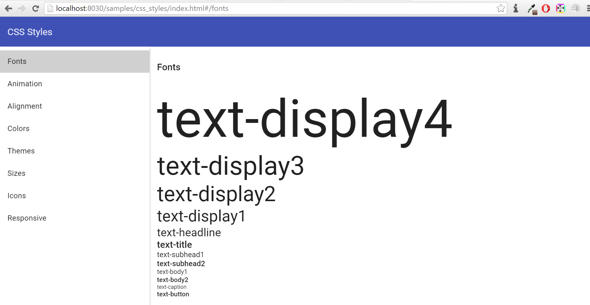
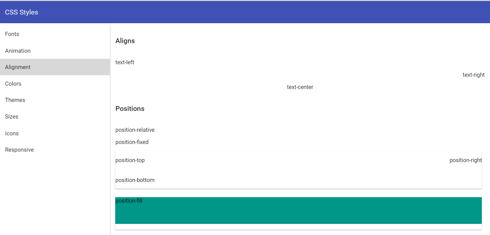
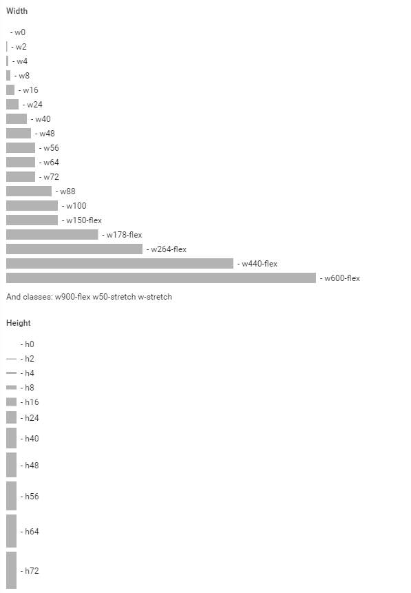
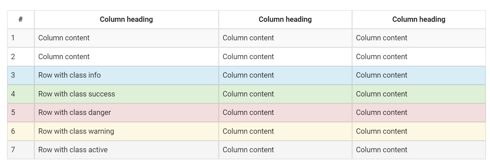
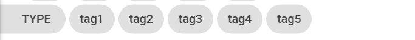
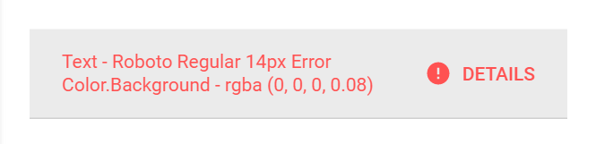

#    CSS styles and components

Angular-Material library this framework is based on provides a pretty complete set of CSS styles that include typography and responsiveness. But, real applications would need more. In Pip.WebUI.CSS we collected generic CSS styles that we reused across many web applications. Also, this module contains so called CSS components. In comparison to Angular directives they are extremely light-weight and efficient, because they require only CSS styles over basic HTML structure.

### Typography

CSS classes and mixins to set fonts, sizes, styles and other visual text attributes. 

### Positions

CSS classes and mixins to position elements on web pages

### Sizes

CSS classes and mixins to set width, height, paddings and margins for elements

### Flexbox

CSS classes and mixins to extend flexbox layouts implemented by Angular Material.

### Colors

CSS classes and mixins to set colors from predefined pallettes or special color set.

### Animations, transformations and other visual effects

CSS classes and mixins to specify animations and transformations. It also has CSS classes for dividers and opacity.

### Control properties

CSS styles and mixins to change behavior of HTML controls. They allow to change scrolling, cursors and other control properties.

### CSS components

**Reference item** represents a reference with title, details and avatar.

**Reference toolbar** represents a toolbar with item reference and optional action buttons.

**Reference title** is used as a header on the top of details page. It shows title, details and avatar.

**Reference expander** is a clickable elemement that looks similar to **Reference item** but also allows to expand/collapse details.

**Reference list** is a list filled with **Reference items**.

**Simple list** supports hover effects and select marks for the list items.

**Details title** is a standard header for detail panels with title and optional subtitle

**Action list** is a set of big action buttons that are placed at the bottom of a page.

**Drilldown list** is a list with clickable items, that lead to detail information.

**Dividers** to separate content in different places

**Check list** is a list with clickable items and a checkbox as the primary action

**Progress on top** shows linear progress line at the top of a panel without "jumps" of internal content.

**Table** is a temporary table component based on Bootstrap code. It will be removed when Angular-Material team release a normal table

**Empty state** component shows a placeholder for pages without data. It gives an explanation and provides one or few actions to get started.

**Chips** shows a list with read-only chips. It also has special styles for chips that stick to left or right edge.

**Filter row** is used to style filters on the top of a page or panel.

**Error panel** shows an error embedded into a page.

## Learn more about the module

- [User's guide](doc/UsersGuide.md)
- [Online samples](http://webui.pipdevs.com/pip-webui-css/index.html)
- [Developer's guide](doc/DevelopersGuide.md)
- [Changelog](CHANGELOG.md)
- [Pip.WebUI project website](http://www.pipwebui.org)
- [Pip.WebUI project wiki](https://github.com/pip-webui/pip-webui/wiki)
- [Pip.WebUI discussion forum](https://groups.google.com/forum/#!forum/pip-webui)
- [Pip.WebUI team blog](https://pip-webui.blogspot.com/)

## Module dependencies

* [pip-webui-lib](https://github.com/pip-webui/pip-webui-lib): angular material CSS styles

## License

This module is released under [MIT license](License) and totally free for commercial and non-commercial use.
