# Pip.WebUI.CSS User's Guide

## <a name="contents"></a> Contents
- [Installing](#install)
- [Typography styles and mixins](#typography)
- [Positions styles and mixins](#positions)
- [Sizes styles and mixins](#sizes)
- [Flexbox styles and mixins](#flexbox)
- [Colors styles and mixins](#colors)
- [Animations, transitions and visual effects](#effects)
- [Control properties styles and mixins](#controls)
- [pip-ref-item component](#ref_item)
- [pip-ref-toolbar component](#ref_toolbar)
- [pip-ref-title component](#ref_title)
- [pip-ref-expander component](#ref_expander)
- [pip-ref-list component](#ref_list)
- [pip-simple-list component](#simple_list)
- [pip-details-title component](#details_title)
- [pip-action-list component](#action_list)
- [pip-drilldown-list component](#drilldown_list)
- [pip-divider-\* component](#dividers)
- [pip-check-list component](#check_list)
- [pip-progress-top component](#progress_top)
- [pip-table component](#table)
- [pip-empty component](#empty)
- [pip-chips-\* component](#chips)
- [pip-filter-row component](#filter_row)
- [pip-error-panel component](#error_panel)
- [Questions and bugs](#issues)


## <a name="install"></a> Installing

Add dependency to **pip-webui** into your **bower.json** or **package.json** file depending what you use.
```javascript
"dependencies": {
  ...
  "pip-webui": "*"
  ...
}
```

Alternatively you can install **pip-webui** manually using **bower**:
```bash
bower install pip-webui
```

or install it using **npm**:
```bash
npm install pip-webui
```

Include **pip-webui** files into your web application.
```html
<link rel="stylesheet" href=".../pip-webui-lib.min.css"/>
<link rel="stylesheet" href=".../pip-webui.min.css"/>
...
<script src=".../pip-webui-lib.min.js"></script>
```

## <a name="typography"></a> Typography styles and mixins

CSS classes and mixins to set fonts, sizes, styles and other visual text attributes. 

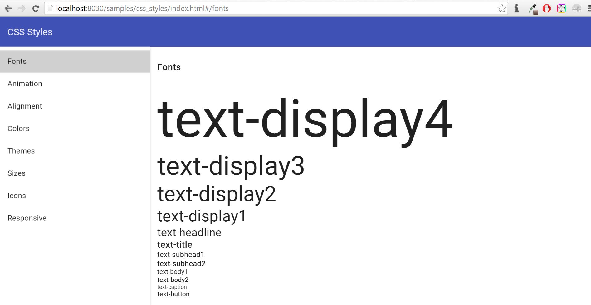

### CSS Classes
* **text-hide** - hide text, add styles font: ~"0/0";
* **text-overflow** - overflow hidden
* **vertical-top** - add styles vertical-align: top;
* **vertical-middle** - add styles vertical-align: middle;
* **vertical-bottom** - add styles vertical-align: bottom;
* **text-left** - add styles text-align: left;
* **text-right** - add styles text-align: right;
* **text-center** - add styles text-align: center;
* **text-display4** - add style font: normal 300 112px Roboto, 'Helvetica Neue', sans-serif;
* **text-display3** - add style font: normal 400 56px Roboto, 'Helvetica Neue', sans-serif;
* **text-display2** - add style font: normal 400 45px Roboto, 'Helvetica Neue', sans-serif;
* **text-display1** - add style font: normal 400 34px Roboto, 'Helvetica Neue', sans-serif;
* **text-headline** - add style font: normal 400 24px Roboto, 'Helvetica Neue', sans-serif;
* **text-title** - add style font: normal 500 20px Roboto, 'Helvetica Neue', sans-serif;
* **text-subhead1** - add style font: normal 400 16px Roboto, 'Helvetica Neue', sans-serif;
* **text-subhead2** - add style font: normal 500 16px Roboto, 'Helvetica Neue', sans-serif;
* **text-body1** - add style font: normal 400 14px Roboto, 'Helvetica Neue', sans-serif;
* **text-body2** - add style font: normal 500 14px Roboto, 'Helvetica Neue', sans-serif;
* **text-caption**  - add style font: normal 400 12px Roboto, 'Helvetica Neue', sans-serif;
* **text-button** - add style font: normal 500 14px Roboto, 'Helvetica Neue', sans-serif;

### LESS Mixins
* **text-hide()** - text hidden 
* **text-overflow()** - overflow text
* **hyphens(@mode: auto)** - optional hyphenation

## <a name="positions"></a> Positions styles and mixins

CSS classes and mixins to position elements on web pages

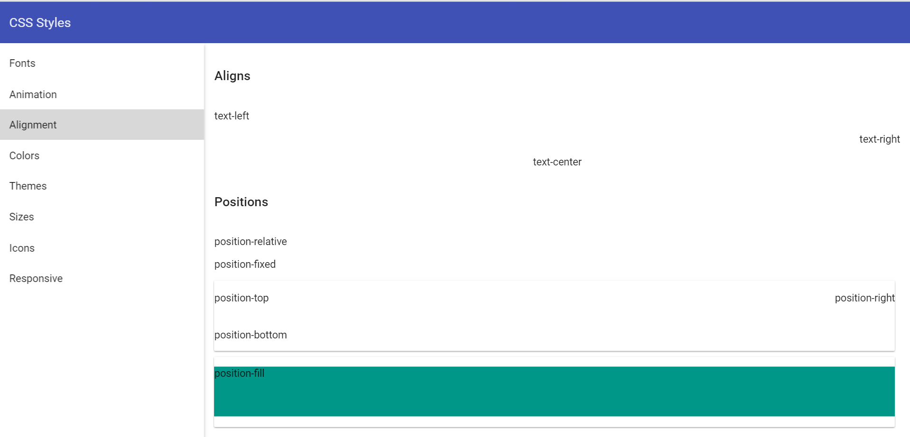

### CSS Classes
* **hidden** - hide from screenreaders and browsers
* **invisible** - add style visibility: hidden
* **display** - add position display 
* **position-relative** - add style position: relative 
* **position-fixed** - add style position: fixed
* **position-fill** - add style position: relative
* **position-top** - add style position: absolute with top: 0 
* **position-bottom** - add style position: absolute with bottom: 0 
* **position-right** - add style position: absolute with right: 0  
* **clearfix** - add style clearfix
* **center-block** - center-align a block level element
* **pull-right** - add style float: right
* **pull-left** - add style float: left

### LESS Mixins
* **center-block()** - center-align a block level element
* **content-columns(@column-count; @column-gap: @grid-gutter-width)** -
* **position-relative()** - add style position: relative 
* **position-fixed()** - add style position: fixed
* **position-absolute(@top, @left, @right, @bottom)** - add style position: absolute 
* **position-fill** - add style position: relative
* **position-top** - add style position: absolute with top: 0 
* **position-bottom** - add style position: absolute with bottom: 0 
* **position-right** - add style position: absolute with right: 0 

## <a name="sizes"></a>  Sizes styles and mixins

CSS classes and mixins to set width, height, paddings and margins for elements

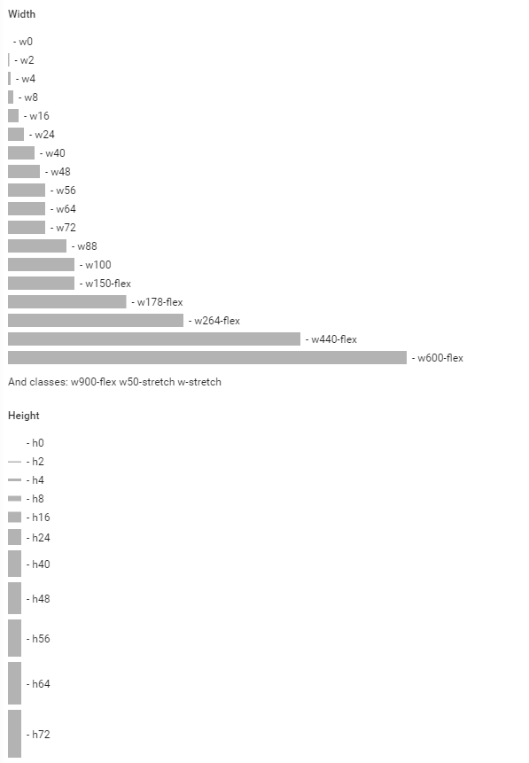

### CSS Classes
* **w0** - add style width: 0
* **w2** - add style width: 2px
* **w4** - add style width: 4px
* **w8** - add style width: 8px
* **w16** - add style width: 16px
* **w24** - add style width: 24px
* **w38** - add style width: 38px
* **w40** - add style width: 40px
* **w48** - add style width: 48px
* **w56** - add style width: 56px
* **w64** - add style width: 64px
* **w72** - add style width: 72px
* **w88** - add style width: 88px
* **w100** - add style width: 100px
* **w150-flex** - add style width: 150px 
* **w178-flex** - add style  width: 178px
* **w264-flex** - add style  width: 264px
* **w440-flex** - add style  width: 440px
* **w600-flex** - add style  width: 600px
* **w900-flex** - add style  width: 900px
* **w50-stretch** - add style width: 50%
* **w-stretch** - add style width: 100%
* **min-w24** - add style min-width: 24px
* **min-w48** - add style min-width: 48px
* **min-w56** - add style min-width: 56px
* **min-w64** - add style min-width: 64px
* **min-w72** - add style min-width: 72px
* **min-w33-stretch** - add style min-width: 33%
* **min-w50-stretch** - add style min-width: 50%
* **min-w100** - add style min-width: 100px
* **max-w24** - add style max-width: 24px
* **max-w48** - add style max-width: 48px
* **max-w56** - add style max-width: 56px
* **max-w64** - add style max-width: 64px
* **max-w72** - add style max-width: 72px
* **max-w33-stretch**- add style max-width: 33%
* **max-w50-stretch**- add style max-width: 50%
* **max-w100** - add style max-width: 100px

* **h0** - add style height: 0
* **h2** - add style height: 2px
* **h4** - add style height: 4px
* **h8** - add style height: 8px
* **h16** - add style height: 16px
* **h24** - add style height: 24px
* **h38** - add style height: 38px
* **h40** - add style height: 40px
* **h48** - add style height: 48px
* **h56** - add style height: 56px
* **h64** - add style height: 64px
* **h72** - add style height: 72px
* **h88** - add style height: 88px
* **h100** - add style height: 100px
* **h150-flex** - add style height: 150px 
* **h178-flex** - add style  height: 178px
* **h264-flex** - add style  height: 264px
* **h440-flex** - add style  height: 440px
* **h600-flex** - add style  height: 600px
* **h900-flex** - add style  height: 900px
* **h50-stretch** - add style height: 50%
* **h-stretch** - add style height: 100%
* **min-h24** - add style min-height: 24px
* **min-h48** - add style min-height: 48px
* **min-h56** - add style min-height: 56px
* **min-h64** - add style min-height: 64px
* **min-h72** - add style min-height: 72px
* **min-h33-stretch** - add style min-height: 33%
* **min-h50-stretch** - add style min-height: 50%
* **min-h100** - add style min-height: 100px
* **max-h24** - add style max-height: 24px
* **max-h48** - add style max-height: 48px
* **max-h56** - add style max-height: 56px
* **max-h64** - add style max-height: 64px
* **max-h72** - add style max-height: 72px
* **max-h33-stretch**- add style max-height: 33%
* **max-h50-stretch**- add style max-height: 50%
* **max-h100** - add style max-height: 100px

### LESS Mixins
* **w(@size)** - add width styles
* **min-w(@size)** - add min-width styles
* **max-w(@size)** - add max-width styles
* **h(@size)** - add height styles
* **min-h(@size)** - add min-height styles
* **max-h(@size)** - add max-height styles

* **m(@size)**  - add margin styles
* **tm(@size)** - add margin-top styles
* **bm(@size)** - add margin-bottom styles
* **lm(@size)** - add margin-left styles
* **rm(@size)** - add margin-right styles
* **p(@size)**  - add padding styles
* **tp(@size)** - add padding-top styles
* **bp(@size)** - add padding-bottom styles
* **lp(@size)** - add padding-left styles
* **rp(@size)** - add padding-right styles

* **size(@width; @height)** - add height and width styles
* **square(@size)** - add height and width styles when height = width
* **circle(@size)** - add height and width styles when height = width and add border-radius: 50%

## <a name="flexbox"></a>  Flexbox styles and mixins

CSS classes and mixins to extend flexbox layouts implemented by Angular Material.

### CSS Classes

* **flex** - add display flex
* **flex-direction-row** - add row direction
* **flex-direction-column** - add column direction
* **flex-flow-row-wrap** - add display flex + row direction + flex-wrap: wrap
* **flex-fixed** - is equal to flex-element with parameters 0, 0, auto
* **flex-var** - is equal to flex-element with parameters 1, 1, auto
* **flex-grow** - is equal to flex-element with parameters 1, 0, auto
* **flex-shrink** - is equal to flex-element with parameters 0, 1, auto
* **flex-vertical-center** - add  align-items:center
* **flex-vertical-start** - add align-items:start
* **flex-horizontal-start** - add justify-content with parameters - start, flex-start
* **flex-horizontal-center** - add justify-content with parameters - center center
* **flex-horizontal-end** - justify - content with parameters - end, flex-end

### LESS Mixins

* **flex()** - add display flex
* **flex-direction(@direction)** - add direction
* **flex-direction-row()** - add row direction
* **flex-direction-column()** - add column direction
* **flex-flow(@direction, @wrap)** - add flex direction + flex-wrap
* **flex-flow-row-wrap()** - add display flex + row direction + flex-wrap: wrap;
* **flex-element(@grow, @shrink, @initialSize: auto)** - add flex with parameters
* **flex-fixed()** - is equal to flex-element with parameters 0, 0, auto
* **flex-var()** - is equal to flex-element with parameters 1, 1, auto
* **flex-grow()** - is equal to flex-element with parameters 1, 0, auto
* **flex-shrink()** - is equal to flex-element with parameters 0, 1, auto
* **flex-order(@index)** -  add order index
* **flex-vertical-content(@value)** - add  align-items
* **flex-vertical-center()** - add  align-items:center
* **flex-vertical-start()** - add align-items:start
* **flex-justify-content(@value, @oldValue)** - add justify-content with oldValue for webkit and  value for other browsers
* **flex-horizontal-start()** - add justify-content with parameters - start, flex-start
* **flex-horizontal-center()** - add justify-content with parameters - center center
* **flex-horizontal-end()** - justify - content with parameters - end, flex-end

## <a name="colors"></a>  Colors styles and mixins

CSS classes and mixins to set colors from predefined pallettes or special color set.

Todo: Add screenshot with color styles here

### CSS Classes
Todo: Describe here all CSS classes

### LESS Mixins
Todo: Describe here all CSS mixins


## <a name="effects"></a>  Animations, transformations and other visual effects

CSS classes and mixins to specify animations and transformations. It also has CSS classes for dividers and opacity.

Todo: Add screenshot with effects styles here

### CSS Classes
Todo: Describe here all CSS classes

### LESS Mixins
Todo: Describe here all CSS mixins


## <a name="controls"></a> Control properties styles and mixins

CSS styles and mixins to change behavior of HTML controls. They allow to change scrolling, cursors and other control properties.

Todo: Add screenshot with controls styles here

### CSS Classes
* **scroll** - add styles overflow: auto
* **no-scroll** - add style overflow: hidden
* **scroll-x** - add style for scrolling on the horizontal
* **scroll-y**  - add style for scrolling on the vertical 

* **pointer** - change for pointer cursor
* **cursor-default** - change for default cursor
* **cursor-auto** - change for cursor: auto
* **cursor-move** - change for cursor: move

### LESS Mixins
* **placeholder(@color: @input-color-placeholder)** - add color for placeholder text
* **user-select(@select)** - for selecting text on the page
* **tab-focus()** - webKit-style focus
* **scroll()** - add scrolling styles for both axes
* **scroll-x()** - add style for scrolling on the horizontal
* **scroll-y()**  - add style for scrolling on the vertical 

## <a name="ref_item"></a> pip-ref-item component

**pip-ref-item** represents a reference with title, details and avatar.

### Usage
```html
<div class="pip-ref-item">
    
    <div class="pip-content">
        <p class="pip-title">Pip.Life - Small scale beta</p>
        <p class="pip-subtitle">
            <md-icon md-svg-icon="icons:help" class="pip-icon"></md-icon>
            goal
        </p>
    </div>
</div>
```

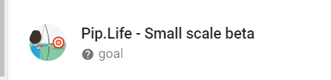

### CSS Classes
* **pip-pic** - class for pictures
* **pip-content** - class for general div 
* **pip-title** - class for title text
* **pip-subtitle** - class for subtitle text


## <a name="ref_toolbar"></a> pip-ref-toolbar component

**pip-ref-toolbar** represents a toolbar with item reference and optional action buttons.

### Usage
```html
<md-toolbar class="pip-ref-toolbar md-hue-1 bm24">
    

    <div class="pip-content">
        <p class="pip-title">Efficiently target long-term high-impact resources after distinctive e-services.</p>

        <p class="pip-subtitle">Goal</p>

        <div class="pip-action">
            <md-button class="md-raised md-primary md-hue-1" ng-click="">Action 1</md-button>
            <md-button class="md-raised md-primary md-hue-1" ng-click="">Action 2</md-button>
        </div>
    </div>
</md-toolbar>
```

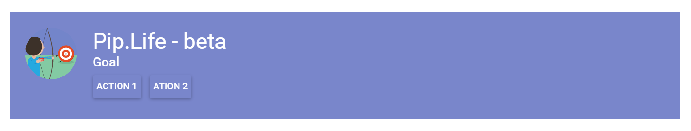

### CSS Classes
* **pip-pic-sm** - class for small picture
* **pip-pic** - class for pictures
* **pip-content** - class for general div 
* **pip-title** - class for title text
* **pip-subtitle** - class for subtitle text
* **pip-actions** - class for div with buttons

## <a name="ref_title"></a> pip-ref-title component

**pip-ref-title** is used as a header on the top of details page. It shows title, details and avatar.

### Usage
```html
<div class="pip-ref-title layout-row">
	

	<div class="flex layout-column layout-align-center-start pip-content">
		<p class="pip-title">Title of vision</p>
		<p class="pip-subtitle">Subtitle of vision</p>
		<md-progress-linear class="tm8"></md-progress-linear>
	</div>
</div>
```


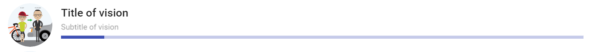

### CSS Classes
* **pip-pic-sm** - class for small picture
* **pip-pic** - class for pictures
* **pip-content** - class for general div 
* **pip-title** - class for title text
* **pip-subtitle** - class for subtitle text

## <a name="ref_expander"></a> pip-ref-expander component

**pip-ref-expander** is a clickable elemement that looks similar to **pip-ref-item** but also allows to expand/collapse details.

### Usage
```html
<div class="pip-ref-expander layout-row layout-align-start-center">
    <md-button class="flex">
        <div class="layout-row layout-align-start-center">
            
            <div class="pip-content flex">
                <p class="pip-title">
                    <md-icon md-svg-icon="icons:forward-all"></md-icon>
                    {{item.name}}
                </p>
                <p class="pip-subtitle">
                    <md-icon md-svg-icon="icons:world"></md-icon>
                    <span>{{item.status1}}</span>
                </p>
            </div>
            <md-icon md-svg-icon="icons:triangle-down" class="pip-chevron"></md-icon>
        </div>
    </md-button>
</div>
```

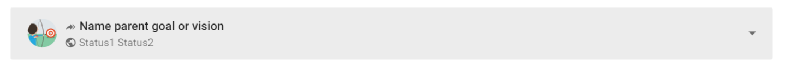

### CSS Classes
* **pip-pic-sm** - class for small picture
* **pip-pic** - class for pictures
* **pip-content** - class for general div 
* **pip-title** - class for title text
* **pip-subtitle** - class for subtitle text

## <a name="ref_list"></a> pip-ref-list component

**pip-ref-list** is a list filled with **pip-ref-item**s.

### Usage
```html

<md-list class="pip-menu pip-ref-list">

    <md-list-item class="pip-ref-list-item lp16 layout-row layout-align-start-start" md-ink-ripple>

        

        <div class="pip-content">
            <div class="layout-row layout-align-space-between-start">
                <div class="flex">
                    <p class="pip-title">{{item.title}} </p>

                    <span class="pip-subtitle">
                        {{item.time}}
                    </span>
                </div>

                <md-chip class="pip-type-chip pip-type-chip-right md-chip">
                    <div class="pip-text">INFO</div>
                </md-chip>
            </div>

            <p class="pip-text-bold" ng-if="item.parent">{{item.parent}}</p>

            <p class="pip-text" ng-if="item.parent">{{item.text}}</p>

            <p class="pip-text-lg" ng-if="!item.parent">{{item.text}}</p>

        </div>
    </md-list-item>
</md-list>
```

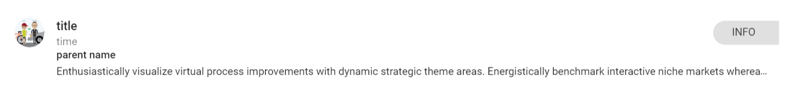

### CSS Classes
* **pip-pic** - class for pictures
* **pip-content** - class for general div 
* **pip-title** - class for title text
* **pip-subtitle** - class for subtitle text
* **pip-text-bold** - class for little bold text 
* **pip-text-lg** - class for max 2 count line 
* **pip-text** - class for normal 16px Roboto text, max 1 line text


## <a name="simple_list"></a> pip-simple-list component

**pip-simple-list** supports hover effects and select marks for the list items.

### Usage
```html
<md-list class="pip-menu pip-simple-list">
    <md-list-item class="pip-simple-list-item pip-selectable" md-ink-ripple ng-repeat="listItem in list">
        <p class="pip-title">{{listItem}}</p>
    </md-list-item>
</md-list>
```

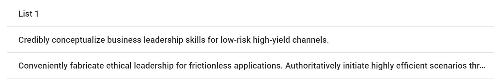

### CSS Classes
* **pip-simple-list-item** - class for simple item
* **pip-title** - class for title

## <a name="details_title"></a> pip-details-title component

**pip-details-title** is a standard header for detail panels with title and optional subtitle

### Usage
```html
<div class="pip-details-title">
    <p class="pip-title">Title (font: normal 500 20px Roboto;)</p>
    <p class="pip-subtitle">Subtitle (font: normal 400 14px Roboto;)</p>
</div>
```

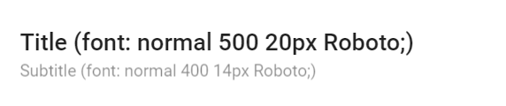

### CSS Classes
* **pip-title** - class for title text
* **pip-subtitle** - class for subtitle text

## <a name="action_list"></a> pip-action-list component

**Action list** is a set of big action buttons that are placed at the bottom of a page.

### Usage
```html

<div class="pip-action-list">

    <md-button class="pip-action-list-item">
        <md-icon class="pip-pic" md-svg-icon="icons:reply"></md-icon>
        <div class="pip-title">Reply</div>
    </md-button>

    <md-button class="pip-action-list-item">
        <md-icon class="pip-pic" md-svg-icon="icons:forward"></md-icon>
        <div class="pip-title">Forward</div>
    </md-button>

    <md-button class="pip-action-list-item">
        <md-icon class="pip-pic" md-svg-icon="icons:cross"></md-icon>
        <div class="pip-title">Delete</div>
    </md-button>
</div>
```

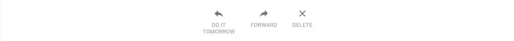

### CSS Classes
* **pip-action-list** - general class for action list
* **pip-action-list-item** - class for item in action list
* **pip-pic** - class for icon in item
* **pip-title** - class for text

## <a name="drilldown_list"></a> pip-drilldown-list component

**Drilldown list** is a list with clickable items, that lead to detail information.

### Usage
```html
<div class="pip-drilldown-list">
    <md-button class="pip-drilldown-list-item pip-drilldown-list-item-lg pip-selected">
        <div class="pip-content">
            <md-icon md-svg-icon="icons:document" class="pip-icon"></md-icon>
            <div class="pip-subcontent flex">
                <p class="pip-title">Share</p>
                <p class="pip-subtitle flex">A: Pip.devs</p>
            </div>
            <p >1/2</p>
            <md-icon md-svg-icon="icons:chevron-right"></md-icon>
        </div>
    </md-button>
</div>
```

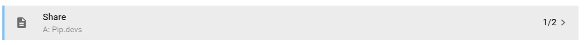

### CSS Classes
* **pip-title** - class for title text
* **pip-subtitle** - class for subtitle text
* **pip-drilldown-list-item-lg** - class for drilldown with tittle and subtitle
* **pip-selected** - class for highlight drilldown item

## <a name="dividers"></a> pip-divider-\* components

**pip-divider**-\* used to separate content in different places

### Usage
```html
<md-card>
    <div class="p24-flex">
        Some text on card
        <div class="pip-divider"></div>
        Some text on card
    </div>

</md-card>
```

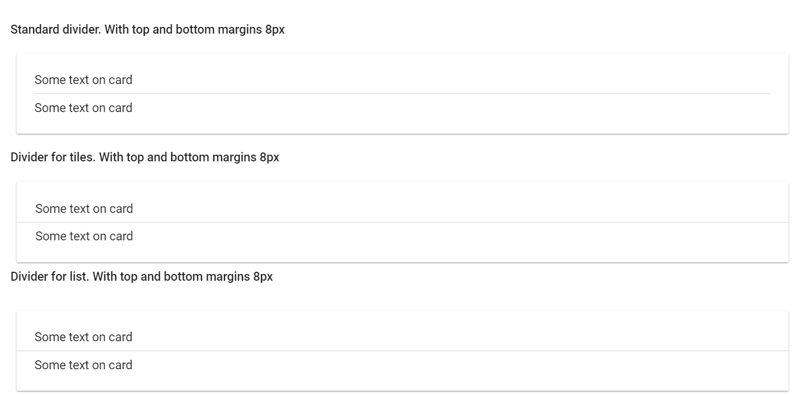

### CSS Classes
* **pip-dividers** - standard divider with top and bottom margins 8рх
* **pip-tile-divider** - divider for tiles with top and bottom margins 8рх
* **pip-list-divider** -  divider for list with top and bottom margins 8рх

## <a name="check_list"></a> pip-check-list component

**pip-check-list** is a list with clickable items and a checkbox as the primary action

### Usage
```html
<md-list class="pip-menu pip-check-list">

    <md-list-item class="pip-check-list-item" md-ink-ripple ng-click="aaa()" ng-repeat="item in items">
        <div class="pip-item-content layout-row layout-align-start-start">
            <md-checkbox class="pip-checkbox"></md-checkbox>

            <div class="pip-content divider-bottom">
                <p class="pip-title">{{item.title}} </p>
                <p class="pip-text-bold">{{item.parent}}</p>
                <p class="pip-text">{{item.text}}</p>
            </div>
        </div>

    </md-list-item>
</md-list>
```

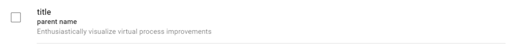

### CSS Classes
* **pip-checkbox** - class for checkbox
* **pip-content** - class for general div 
* **pip-title** - class for title text
* **pip-text-bold** - class for little bold text 
* **pip-text** - class for normal 16px Roboto text, max 1 line text


## <a name="progress_top"></a> pip-progress-top component

**progress-top** shows linear progress line at the top of a panel without "jumps" of internal content.

### Usage
```html
<md-card class="lm0">
    <div class="p24">
        <md-progress-linear class="pip-progress-top"> </md-progress-linear>

        Some text on card
    </div>

</md-card>
```
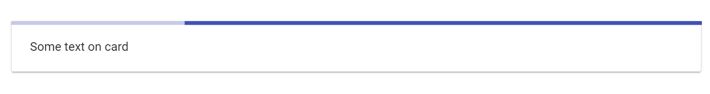

## <a name="table"></a> pip-table component

**pip-table** is a temporary table component based on Bootstrap code. It will be removed when Angular-Material team release a normal table

### Usage
```html
<table class="table table-striped table-hover ">
	<thead>
	<tr>
		<th>#</th>
		<th>Column heading</th>
		<th>Column heading</th>
		<th>Column heading</th>
	</tr>
	</thead>
	<tbody>
	<tr>
		<td>1</td>
		<td>Column content</td>
		<td>Column content</td>
		<td>Column content</td>
	</tr>
	<tr>
		<td>2</td>
		<td>Column content</td>
		<td>Column content</td>
		<td>Column content</td>
	</tr>
	<tr class="info">
		<td>3</td>
		<td>Row with class info</td>
		<td>Column content</td>
		<td>Column content</td>
	</tr>
	<tr class="success">
		<td>4</td>
		<td>Row with class success</td>
		<td>Column content</td>
		<td>Column content</td>
	</tr>
	<tr class="danger">
		<td>5</td>
		<td>Row with class danger</td>
		<td>Column content</td>
		<td>Column content</td>
	</tr>
	<tr class="warning">
		<td>6</td>
		<td>Row with class warning</td>
		<td>Column content</td>
		<td>Column content</td>
	</tr>
	<tr class="active">
		<td>7</td>
		<td>Row with class active</td>
		<td>Column content</td>
		<td>Column content</td>
	</tr>
	</tbody>
</table>
```

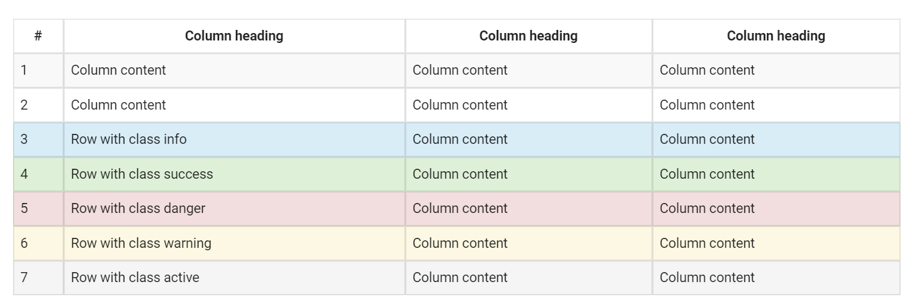

### CSS Classes
* **table** - class for table styles
* **table-hover** - class for hover effects in table

## <a name="empty"></a> pip-empty component

**pip-empty** component shows a placeholder for pages without data. It gives an explanation and provides one or few actions to get started.

### Usage
```html
<div class="pip-empty" >
        <div style="background-image: url('images/ES_Timeline.svg');" class="pip-pic" ></div>

        <div class="pip-text">
            Here you can plan the main events of the day and coordinate with your partners
        </div>
        <div class="pip-actions">
            <md-button class="md-accent">
                ADD EVENT
            </md-button>
            <md-button class="md-accent">
                ADD EVENT FROM CURRENT WEEK
            </md-button>
            <md-button class="md-accent">
                WORK ON GOALS
            </md-button>
        </div>

    </div>
```

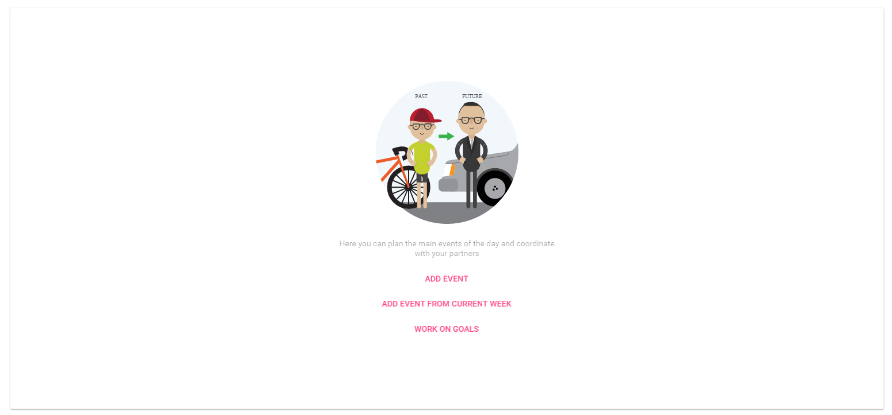

### CSS Classes
* **pip-empty** - general class for pip-empty component
* **pip-text** - class for text 
* **pip-pic** - class for picture
* **pip-actions** - class for div with buttons

## <a name="chips"></a> pip-chip-\* components

**pip-chips**-\* shows a list with read-only chips. It also has special styles for chips that stick to left or right edge.

### Usage
```html
<div>
    <div class="pip-type-chip pip-type-chip-left">
        <span>Type</span>
    </div>
    <div class="pip-chip" ng-repeat="tag in tags">
        <span>{{::tag}}</span>
    </div>
</div>
```

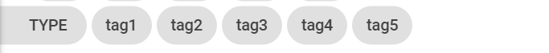

### CSS Classes
* **pip-type-chip** - class for chips of type
* **pip-chip** - general class for chips

## <a name="filter_row"></a> pip-filter-row components

**pip-filter-row** is used to style filters on the top of a page or panel.

### Usage
```html
<div class="pip-filter-row divider-bottom layout-row layout-align-start-center">
    <div class="pip-filter-text">
       Priority
    </div>

    <md-input-container class="md-block">
        <md-select ng-disable="{{disableControls}}" class="flex"
                   aria-label="Status" ng-model="topicModel1">
            <md-option ng-value="opt" ng-repeat="opt in topic1">
                {{::opt}}
            </md-option>
        </md-select>
    </md-input-container>
</div>
```

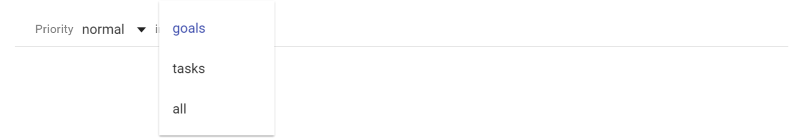

### CSS Classes
* **pip-filter-text** - text in filter row

## <a name="error_panel"></a> pip-error-panel components

**pip-error-panel** shows an error embedded into a page.

### Usage
```html
 <div class="pip-page-errors">
        <span class="pip-error-text">Roboto Regular 14px Error Color.Background - rgba (0, 0, 0, 0.08) </span>
        <a class="pip-error-details">
            <md-icon md-svg-icon="icons:warn-circle"></md-icon>
            <span class="flex"> DETAILS  </span>
        </a>
    </div>
```

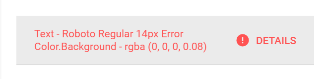

### CSS Classes
* **pip-error-text** - text error
* **pip-error-details** - class for div with details information

## <a name="issues"></a> Questions and bugs

If you have any questions regarding the module, you can ask them using our 
[discussion forum](https://groups.google.com/forum/#!forum/pip-webui).

Bugs related to this module can be reported using [github issues](https://github.com/pip-webui/pip-webui-css/issues).
