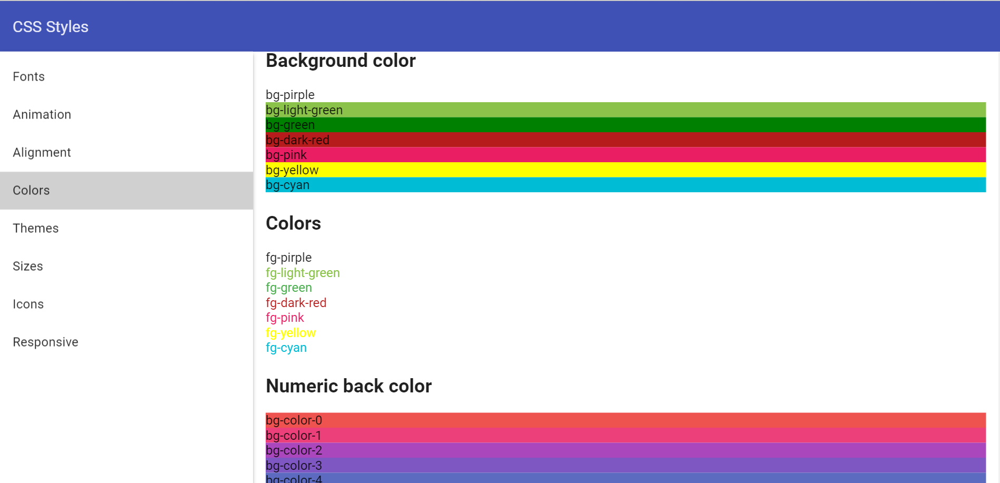
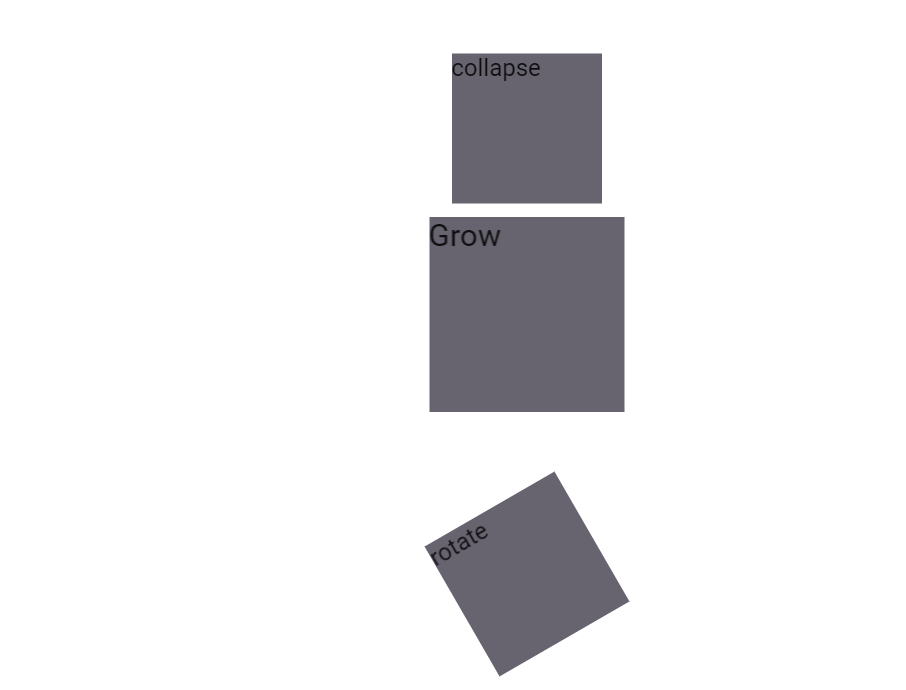

# Pip.WebUI.CSS User's Guide

## <a name="contents"></a> Contents
- [Installing](#install)
- [Typography styles and mixins](#typography)
- [Positions styles and mixins](#positions)
- [Sizes styles and mixins](#sizes)
- [Flexbox styles and mixins](#flexbox)
- [Colors styles and mixins](#colors)
- [Animations, transitions and visual effects](#effects)
- [Control properties styles and mixins](#controls)
- [Questions and bugs](#issues)


## <a name="install"></a> Installing

Add dependency to **pip-webui** into your **bower.json** or **package.json** file depending what you use.
```javascript
"dependencies": {
  ...
  "pip-webui": "*"
  ...
}
```

Alternatively you can install **pip-webui** manually using **bower**:
```bash
bower install pip-webui
```

or install it using **npm**:
```bash
npm install pip-webui
```

Include **pip-webui** files into your web application.
```html
<link rel="stylesheet" href=".../pip-webui-lib.min.css"/>
<link rel="stylesheet" href=".../pip-webui.min.css"/>
...
<script src=".../pip-webui-lib.min.js"></script>
```

## <a name="typography"></a> Typography styles and mixins

CSS classes and mixins to set fonts, sizes, styles and other visual text attributes. 


### CSS Classes
* **text-hide** - hide text, add styles font: ~"0/0";
* **text-overflow** - overflow hidden
* **vertical-top** - add styles vertical-align: top;
* **vertical-middle** - add styles vertical-align: middle;
* **vertical-bottom** - add styles vertical-align: bottom;
* **text-left** - add styles text-align: left;
* **text-right** - add styles text-align: right;
* **text-center** - add styles text-align: center;
* **text-display4** - add style font: normal 300 112px Roboto, 'Helvetica Neue', sans-serif;
* **text-display3** - add style font: normal 400 56px Roboto, 'Helvetica Neue', sans-serif;
* **text-display2** - add style font: normal 400 45px Roboto, 'Helvetica Neue', sans-serif;
* **text-display1** - add style font: normal 400 34px Roboto, 'Helvetica Neue', sans-serif;
* **text-headline** - add style font: normal 400 24px Roboto, 'Helvetica Neue', sans-serif;
* **text-title** - add style font: normal 500 20px Roboto, 'Helvetica Neue', sans-serif;
* **text-subhead1** - add style font: normal 400 16px Roboto, 'Helvetica Neue', sans-serif;
* **text-subhead2** - add style font: normal 500 16px Roboto, 'Helvetica Neue', sans-serif;
* **text-body1** - add style font: normal 400 14px Roboto, 'Helvetica Neue', sans-serif;
* **text-body2** - add style font: normal 500 14px Roboto, 'Helvetica Neue', sans-serif;
* **text-caption**  - add style font: normal 400 12px Roboto, 'Helvetica Neue', sans-serif;
* **text-button** - add style font: normal 500 14px Roboto, 'Helvetica Neue', sans-serif;

### SCSS Mixins
* **text-hide()** - text hidden 
* **text-overflow()** - overflow text
* **hyphens($mode: auto)** - optional hyphenation

## <a name="positions"></a> Positions styles and mixins

CSS classes and mixins to position elements on web pages


### CSS Classes
* **hidden** - hide from screenreaders and browsers
* **invisible** - add style visibility: hidden
* **display** - add position display 
* **position-relative** - add style position: relative 
* **position-fixed** - add style position: fixed
* **position-fill** - add style position: relative
* **position-top** - add style position: absolute with top: 0 
* **position-bottom** - add style position: absolute with bottom: 0 
* **position-right** - add style position: absolute with right: 0  
* **clearfix** - add style clearfix
* **center-block** - center-align a block level element
* **pull-right** - add style float: right
* **pull-left** - add style float: left

### SCSS Mixins
* **center-block()** - center-align a block level element
* **content-columns($column-count; $column-gap: $grid-gutter-width)** -
* **position-relative()** - add style position: relative 
* **position-fixed()** - add style position: fixed
* **position-absolute($top, $left, $right, $bottom)** - add style position: absolute 
* **position-fill** - add style position: relative
* **position-top** - add style position: absolute with top: 0 
* **position-bottom** - add style position: absolute with bottom: 0 
* **position-right** - add style position: absolute with right: 0 

## <a name="sizes"></a>  Sizes styles and mixins

CSS classes and mixins to set width, height, paddings and margins for elements


### CSS Classes
* **w0** - add style width: 0
* **w2** - add style width: 2px
* **w4** - add style width: 4px
* **w8** - add style width: 8px
* **w16** - add style width: 16px
* **w24** - add style width: 24px
* **w38** - add style width: 38px
* **w40** - add style width: 40px
* **w48** - add style width: 48px
* **w56** - add style width: 56px
* **w64** - add style width: 64px
* **w72** - add style width: 72px
* **w88** - add style width: 88px
* **w100** - add style width: 100px
* **w150-flex** - add style width: 150px 
* **w178-flex** - add style  width: 178px
* **w264-flex** - add style  width: 264px
* **w440-flex** - add style  width: 440px
* **w600-flex** - add style  width: 600px
* **w900-flex** - add style  width: 900px
* **w50-stretch** - add style width: 50%
* **w-stretch** - add style width: 100%
* **min-w24** - add style min-width: 24px
* **min-w48** - add style min-width: 48px
* **min-w56** - add style min-width: 56px
* **min-w64** - add style min-width: 64px
* **min-w72** - add style min-width: 72px
* **min-w33-stretch** - add style min-width: 33%
* **min-w50-stretch** - add style min-width: 50%
* **min-w100** - add style min-width: 100px
* **max-w24** - add style max-width: 24px
* **max-w48** - add style max-width: 48px
* **max-w56** - add style max-width: 56px
* **max-w64** - add style max-width: 64px
* **max-w72** - add style max-width: 72px
* **max-w33-stretch**- add style max-width: 33%
* **max-w50-stretch**- add style max-width: 50%
* **max-w100** - add style max-width: 100px

* **h0** - add style height: 0
* **h2** - add style height: 2px
* **h4** - add style height: 4px
* **h8** - add style height: 8px
* **h16** - add style height: 16px
* **h24** - add style height: 24px
* **h38** - add style height: 38px
* **h40** - add style height: 40px
* **h48** - add style height: 48px
* **h56** - add style height: 56px
* **h64** - add style height: 64px
* **h72** - add style height: 72px
* **h88** - add style height: 88px
* **h100** - add style height: 100px
* **h150-flex** - add style height: 150px 
* **h178-flex** - add style  height: 178px
* **h264-flex** - add style  height: 264px
* **h440-flex** - add style  height: 440px
* **h600-flex** - add style  height: 600px
* **h900-flex** - add style  height: 900px
* **h50-stretch** - add style height: 50%
* **h-stretch** - add style height: 100%
* **min-h24** - add style min-height: 24px
* **min-h48** - add style min-height: 48px
* **min-h56** - add style min-height: 56px
* **min-h64** - add style min-height: 64px
* **min-h72** - add style min-height: 72px
* **min-h33-stretch** - add style min-height: 33%
* **min-h50-stretch** - add style min-height: 50%
* **min-h100** - add style min-height: 100px
* **max-h24** - add style max-height: 24px
* **max-h48** - add style max-height: 48px
* **max-h56** - add style max-height: 56px
* **max-h64** - add style max-height: 64px
* **max-h72** - add style max-height: 72px
* **max-h33-stretch**- add style max-height: 33%
* **max-h50-stretch**- add style max-height: 50%
* **max-h100** - add style max-height: 100px

### SCSS Mixins
* **w($size)** - add width styles
* **min-w($size)** - add min-width styles
* **max-w($size)** - add max-width styles
* **h($size)** - add height styles
* **min-h($size)** - add min-height styles
* **max-h($size)** - add max-height styles

* **m($size)**  - add margin styles
* **tm($size)** - add margin-top styles
* **bm($size)** - add margin-bottom styles
* **lm($size)** - add margin-left styles
* **rm($size)** - add margin-right styles
* **p($size)**  - add padding styles
* **tp($size)** - add padding-top styles
* **bp($size)** - add padding-bottom styles
* **lp($size)** - add padding-left styles
* **rp($size)** - add padding-right styles

* **size($width; $height)** - add height and width styles
* **square($size)** - add height and width styles when height = width
* **circle($size)** - add height and width styles when height = width and add border-radius: 50%

## <a name="flexbox"></a>  Flexbox styles and mixins

CSS classes and mixins to extend flexbox layouts implemented by Angular Material.

### CSS Classes

* **flex** - add display flex
* **flex-direction-row** - add row direction
* **flex-direction-column** - add column direction
* **flex-flow-row-wrap** - add display flex + row direction + flex-wrap: wrap
* **flex-fixed** - is equal to flex-element with parameters 0, 0, auto
* **flex-var** - is equal to flex-element with parameters 1, 1, auto
* **flex-grow** - is equal to flex-element with parameters 1, 0, auto
* **flex-shrink** - is equal to flex-element with parameters 0, 1, auto
* **flex-vertical-center** - add  align-items:center
* **flex-vertical-start** - add align-items:start
* **flex-horizontal-start** - add justify-content with parameters - start, flex-start
* **flex-horizontal-center** - add justify-content with parameters - center center
* **flex-horizontal-end** - justify - content with parameters - end, flex-end

### SCSS Mixins

* **flex()** - add display flex
* **flex-direction($direction)** - add direction
* **flex-direction-row()** - add row direction
* **flex-direction-column()** - add column direction
* **flex-flow($direction, $wrap)** - add flex direction + flex-wrap
* **flex-flow-row-wrap()** - add display flex + row direction + flex-wrap: wrap;
* **flex-element($grow, $shrink, $initialSize: auto)** - add flex with parameters
* **flex-fixed()** - is equal to flex-element with parameters 0, 0, auto
* **flex-var()** - is equal to flex-element with parameters 1, 1, auto
* **flex-grow()** - is equal to flex-element with parameters 1, 0, auto
* **flex-shrink()** - is equal to flex-element with parameters 0, 1, auto
* **flex-order($index)** -  add order index
* **flex-vertical-content($value)** - add  align-items
* **flex-vertical-center()** - add  align-items:center
* **flex-vertical-start()** - add align-items:start
* **flex-justify-content($value, $oldValue)** - add justify-content with oldValue for webkit and  value for other browsers
* **flex-horizontal-start()** - add justify-content with parameters - start, flex-start
* **flex-horizontal-center()** - add justify-content with parameters - center center
* **flex-horizontal-end()** - justify - content with parameters - end, flex-end

## <a name="colors"></a>  Colors styles and mixins

CSS classes and mixins to set colors from predefined pallettes or special color set.



### CSS Classes
* **blue** - start blue theme
* **pink** - pink theme
* **orange** - orange theme
* **amber** - amber theme
* **green** - green theme
* **navy** - navy theme
* **grey** - grey theme

* **bg-purple** - purple background
* **border-purple** - purple border
* **fg-purple** - purple text
* **bg-light-green** - light-green background
* **border-light-green** - light-green border
* **fg-light-green** - light-green text
* **bg-dark-red** - dark-red background
* **border-dark-red** - dark-red  border
* **fg-dark-red** - dark-red text
* **bg-pink** - pink background
* **border-pink** - pink border
* **fg-pink** - pink text
* **bg-cyan** - cyan background
* **border-cyan** - cyan border
* **fg-cyan** - cyan text
* **bg-deep-orange** - deep-orange background
* **border-deep-orange** - deep-orange border
* **fg-deep-orange** - deep-orange text
* **bg-teal** - teal background
* **border-teal** - teal border
* **fg-teal** - teal text

### SCSS Mixins
* **generate-theme($name, $palette)** - mixin for generate theme with $name. This mixin add class:
   - **color-primary** - color text (extract($palette, 1))
   - **color-primary-bg** - color  background (extract($palette, 1))
   - **color-accent** - color text (extract($palette, 2))
   - **color-accent-bg** -  color  background (extract($palette, 2))
   - **color-accent-hue-bg** -  color  background (extract($palette, 12))
   - **color-hue** -  color text (extract($palette, 3))
   - **color-hue-bg** -  color  background (extract($palette, 3))
   - **color-primary-text** -  color for primaty text (extract($palette, 4))
   - **color-secondary-text** - color for text  with opacity (extract($palette, 5))
   - **color-divider** - color for all dividers (extract($palette, 6))
   - **color-badge** - color for badge text (extract($palette, 7))
   - **color-badge-bg** - color for badge background (extract($palette, 7))
   - **color-error** - color for error hints  (extract($palette, 8))
   - **color-toast** - background for toast  message (extract($palette, 9))
   - **color-content-bg** - color background for content (extract($palette, 10))
   - **color-window-bg** - color background for window (extract($palette, 11))
   - **color-disabled** - text color for disabled text
   - **color-disabled-bg** - color background for disabling div

## <a name="effects"></a>  Animations, transformations and other visual effects

CSS classes and mixins to specify animations and transformations. It also has CSS classes for dividers and opacity.



### CSS Classes
* **fade** - fade animation
* **collapse** - collapse animation
* **grow** - grow animation
* **shrink** - shrink animation
* **rotate** - rotate animation
* **pip-blink-text** - blinking text

### SCSS Mixins
* **animation ($name, $duration: 300ms, $delay: 0, $ease: ease)** - add animation style
* **animation-name($name)** - set animation name
* **animation-duration($duration)** - set animation duration
* **animation-timing-function($timing-function)** - add style for timing animation
* **animation-delay($delay)** - set delay of animation 
* **animation-direction($direction)** - set direction of animation
* **animation-fill-mode($fill-mode)** - set fill mode
* **backface-visibility($visibility)** - prevent browsers from flickering when using CSS 3D transforms. Default value is `visible`, but can be changed to `hidden`
* **pip-blink()** - add class for blinking text

## <a name="controls"></a> Control properties styles and mixins

CSS styles and mixins to change behavior of HTML controls. They allow to change scrolling, cursors and other control properties.

### CSS Classes
* **scroll** - add styles overflow: auto
* **no-scroll** - add style overflow: hidden
* **scroll-x** - add style for scrolling on the horizontal
* **scroll-y**  - add style for scrolling on the vertical 

* **pointer** - change for pointer cursor
* **cursor-default** - change for default cursor
* **cursor-auto** - change for cursor: auto
* **cursor-move** - change for cursor: move

### SCSS Mixins
* **placeholder($color: $input-color-placeholder)** - add color for placeholder text
* **user-select($select)** - for selecting text on the page
* **tab-focus()** - webKit-style focus
* **scroll()** - add scrolling styles for both axes
* **scroll-x()** - add style for scrolling on the horizontal
* **scroll-y()**  - add style for scrolling on the vertical 

## <a name="issues"></a> Questions and bugs

If you have any questions regarding the module, you can ask them using our 
[discussion forum](https://groups.google.com/forum/#!forum/pip-webui).

Bugs related to this module can be reported using [github issues](https://github.com/pip-webui/pip-webui-css/issues).
